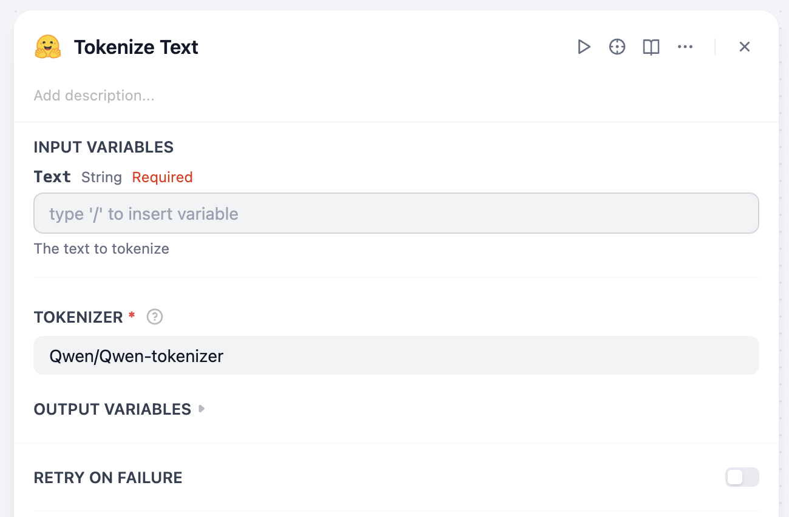

## dify-plugin-tokenize

**Author:** jingfelix

**Version:** 0.0.1

**Type:** tool

### Description

Tokenizing text using various tokenizers from transformers.AutoTokenizer. Returns the token count.

### Usage

> [!NOTE]
> Access to huggingface.co is required to download the tokenizer.

> [!WARNING]
> Due to the plugin execution environment limitations of cloud.dify.ai, this plugin is only available for use in **self-hosted environments**.

You can choose the tokenizer by specifying the `tokenizer` parameter. The default is `gpt2`. This plugin utilizes the `transformers` library to tokenize text. So please check https://huggingface.co/docs/transformers/v4.52.3/en/model_doc/auto#transformers.AutoTokenizer if the tokenizer you want to use is supported.

### PRIVACY

Please refer to the [privacy policy](PRIVACY.md) for more information on how your data is handled.

Last updated: 2025-06-26
